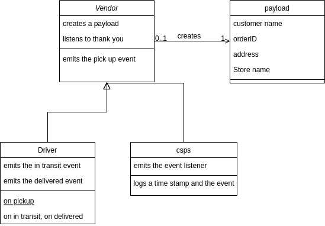

# caps
an application for a product called CAPS - The Code Academy Parcel Service. Which is a system that emulates a real world supply chain.

Pull request link: https://github.com/nour-alsatari/caps/pull/3

UML: 

to run the code:
in the root open 3 terminals and run the commands in the following order. 

1) node csps
2) node apps/driver
3) apps/vendor

The output will be on the driver terminal